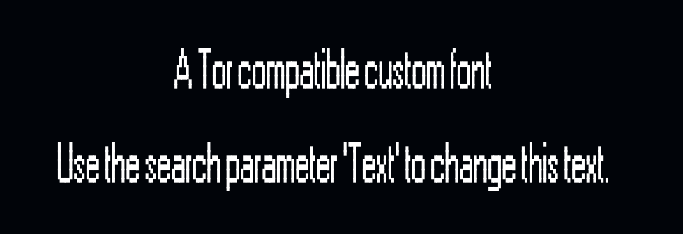

<div align = center >

#  Charagraphy Demo

Simple demonstration of Charagraphy,  
substituting custom fonts using ASCII art.  

<br>

[\[ Demo \]][Demo]  

<br>



<br>

*If the demo doesn't look like this, your*  
*systems monospace font might be problematic.*

</div>

<br>

## Concept

In constraint environments - such as the Tor browser -  
custom fonts are blocked ( by default ) for security reasons.

To work around this and have more styling choices, we  
simply have to make our own font, to this end we can  
use charagraphy ( ASCII Text Art ) to recreate certain fonts.

This demo uses the **[@pordeno/ascii-font]** library to convert  
text into multiline combinations of **[Block Element]** characters  
that aim to emulate the look of the old **MS Sans Serif font**.

>   [!Important]
>   Without the `.Text` rule in [`Style.css`] the text won't look correct 

<br>

## How To

-   Install **[Deno]**

-   Start the server

    ```sh
    deno run dev
    ```

-   Open a browser at

    ```
    http://localhost:8000
    ```

<br>


<!----------------------------------------------------------------------------->

[@pordeno/ascii-font]: https://github.com/Pordeno/Ascii-Font
[Block Element]: https://symbl.cc/en/unicode/blocks/block-elements/
[Demo]: https://jsless-demo-tor-font.deno.dev/
[Deno]: https://deno.com/

[`Style.css`]: ./Source/Style.css
